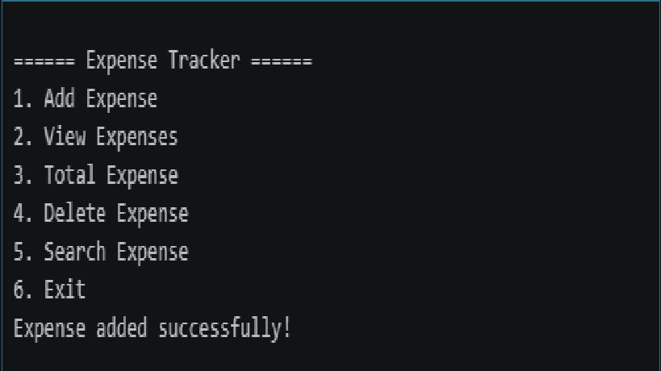
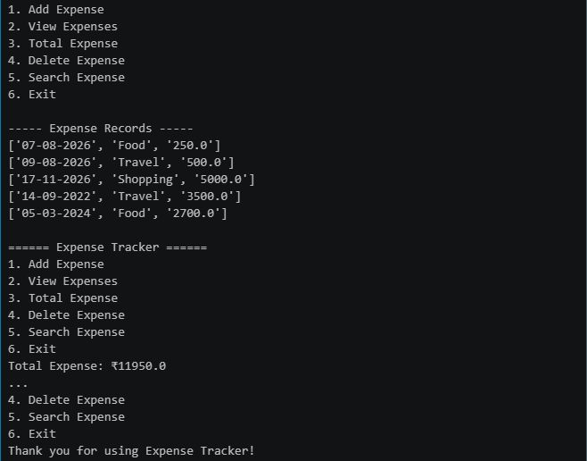
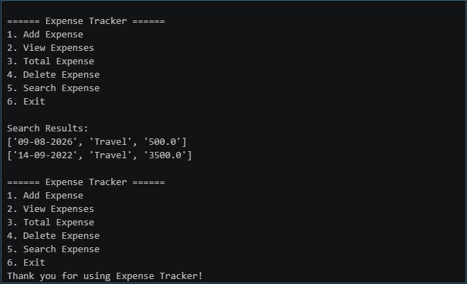

# Expense Tracker

## Internship Details

- **Intern ID:** CITS7454
- **Intern Name:** Mithish Prabu
- **Internship Domain:** Python Programming
- **Project Name:** Expense Tracker
- **Internship Duration:** 8 Weeks

## Project Overview

The Expense Tracker is a Python-based application designed to help users manage their daily expenses. It allows users to add, view, calculate, remove, and search expense records.

## Objective

The objective of this project is to develop a simple expense management application using Python and store expense data in CSV and JSON formats.

## Project Scope

This project focuses on developing a simple Python-based expense management system for recording and managing daily expenses. It provides basic expense operations such as adding, viewing, calculating, removing, and searching expenses, while maintaining the data in CSV and JSON formats.

## Features

- Add new expenses
- View all expense records
- Calculate total expenses
- Remove an expense
- Search expenses by category
- Store data in CSV format
- Store data in JSON format
- Menu-driven interface

## Technologies Used

- Python
- CSV
- JSON
- Jupyter Notebook
- VS Code

## Project Structure

```text
Task1_Expense_Tracker/
│
├── Task1_Expense_Tracker.ipynb
├── expenses.csv
├── expenses.json
└── README.md
```

## How to Run

1. Open the `Task1_Expense_Tracker.ipynb` file in VS Code.
2. Make sure Python and Jupyter Notebook support are available.
3. Run the notebook cells from top to bottom.
4. Use the menu-driven interface to manage expenses.
5. Select the required option from the menu.

## Menu Options

```text
1. Add Expense
2. View Expenses
3. Total Expense
4. Delete Expense
5. Search Expense
6. Exit
```

## Data Storage

The application stores expense records in two formats:

- `expenses.csv` - stores expense records in CSV format.
- `expenses.json` - stores expense records in structured JSON format.

## Sample Expense Records

| Date | Category | Amount |
|------|----------|--------|
| 07-08-2026 | Food | 250.0 |
| 09-08-2026 | Travel | 500.0 |

## Sample Output

```text
====== Expense Tracker ======

1. Add Expense
2. View Expenses
3. Total Expense
4. Delete Expense
5. Search Expense
6. Exit
```

The application successfully displays expense records and calculates the total expense.

## Screenshots

### Add Expense



### View and Total Expense



### Search Expense



## Conclusion

The Expense Tracker successfully demonstrates Python programming, file handling, data storage, and menu-driven application development. It provides a simple way to record, view, calculate, remove, and search daily expenses.

## Author

Mithish Prabu